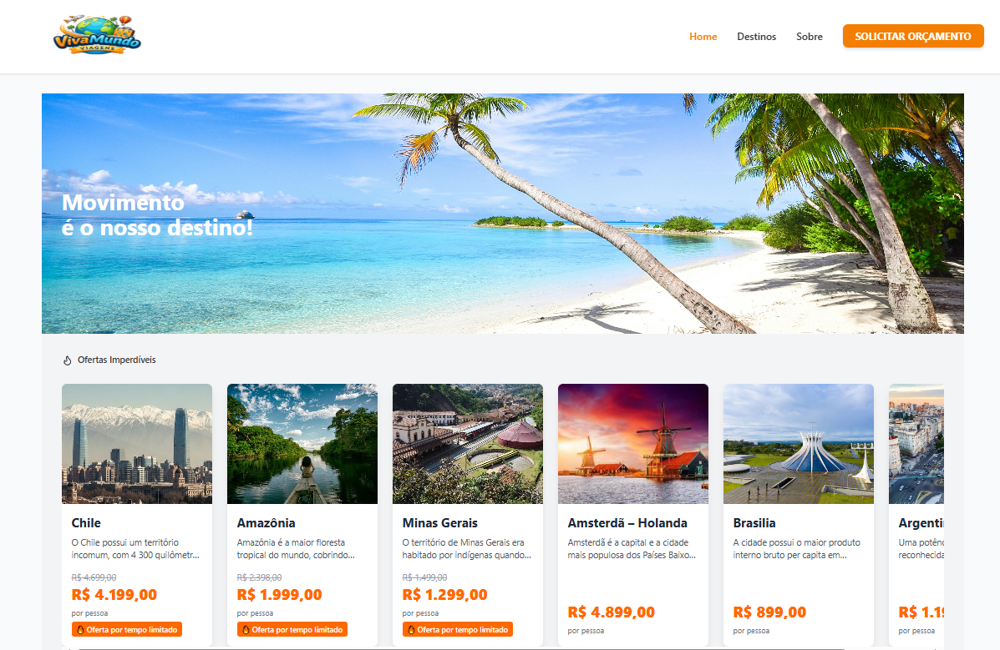
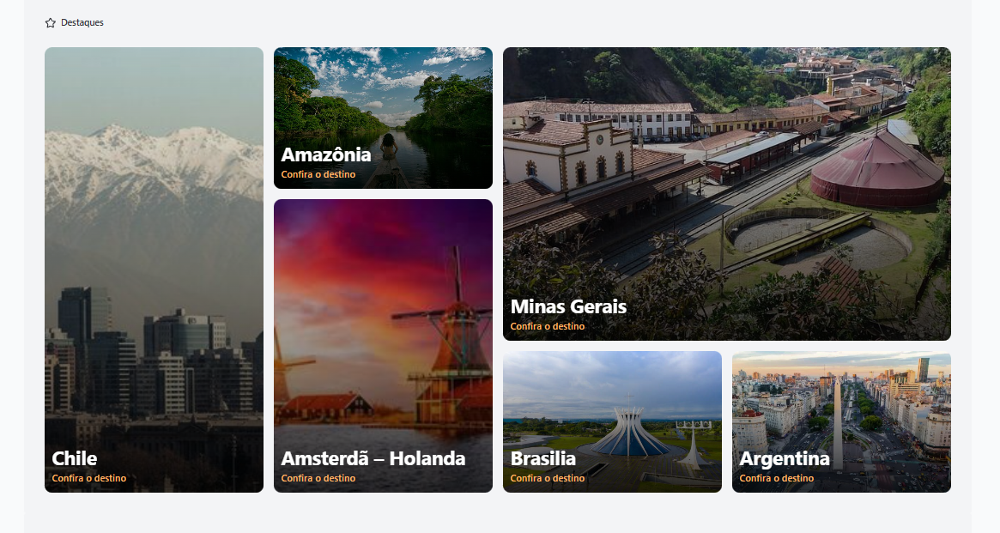
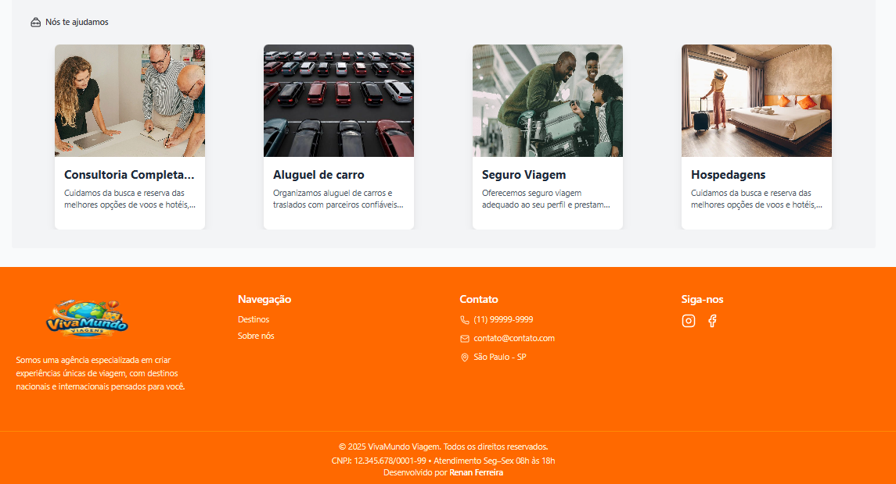
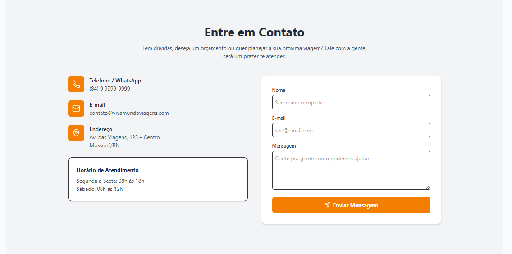
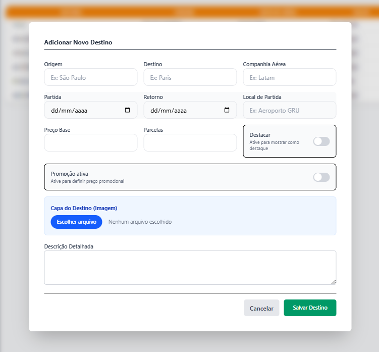
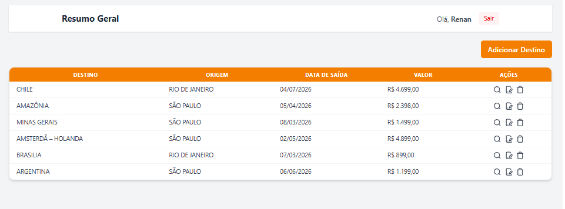

# 🌍 VivaMundo – Agência de Viagens

O **VivaMundo** é uma aplicação web moderna para divulgação e visualização de pacotes de viagens, desenvolvida com **React + Vite**, focada em performance, boa experiência do usuário e fácil integração com backend (Strapi / APIs externas).

O projeto permite exibir destinos, preços promocionais, datas, companhias aéreas e imagens, simulando o site de uma agência de viagens real.
[Acesse](https://vivamundoviagens.netlify.app/)
---

## 🚀 Tecnologias Utilizadas

### Frontend

- ⚛️ **React 19**
- ⚡ **Vite**
- 🎨 **Tailwind CSS**
- 🔄 **React Router DOM**
- 📦 **React Query (TanStack Query)**
- 📝 **React Hook Form**
- 🔔 **React Hot Toast**
- 🎯 **Lucide React (ícones)**

### Backend / Integrações

- 🔐 **Strapi** (autenticação)
- 🌐 **API REST**

---

### Screenshots

###### Home









###### Dashboard





---

## 📂 Estrutura do Projeto

```bash
src/
├── ui/        # Componentes reutilizáveis (CardViagem, Button, etc)
├── pages/             # Páginas da aplicação
├── services/          # Integração com APIs
├── utils/             # Funções utilitárias (ex: cálculo de preço)
├── hooks/             # Hooks customizados
├── routes/            # Configuração de rotas
└── main.jsx           # Entry point
```
